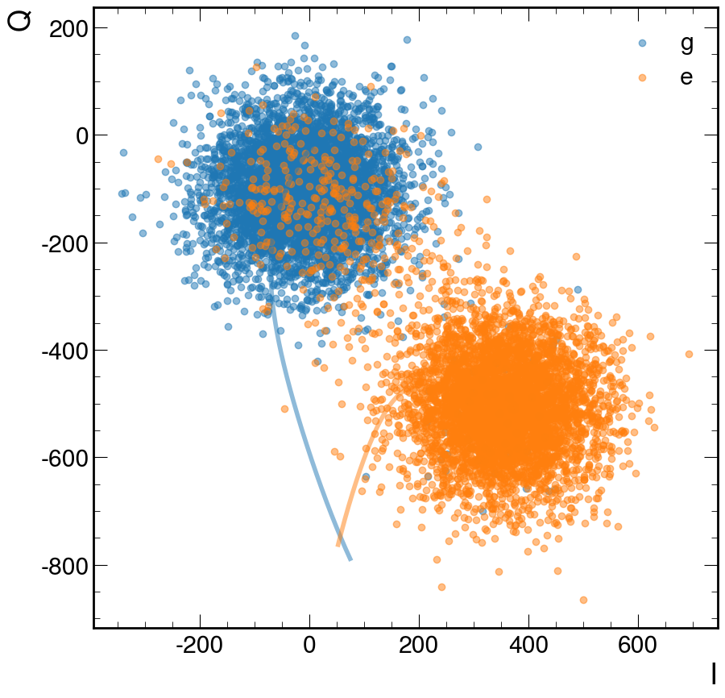

# Data

## Where the data lives

The data is **not stored in git**. It lives on the NAS at `/nas/work/research/quantum/readout/data/`, and these paths in the repo are symlinks to it:

- `data/fpga_testing`
- `data/qick_data`
- `data/qubit_readout_purdue`

To recreate the links on a machine that mounts the NAS, run `data/link_data.sh`. It skips (with a warning) any path that already exists.

## Available data

There are two families of single-qubit data:

- **Quantum Machine**: real raw data, see [Quantum Machine](#quantum-machine). Download: [SharePoint](https://purdue0-my.sharepoint.com/:f:/g/personal/oyesilyu_purdue_edu/EuhbLM-wFApNiX9Mh5ZMeIEBG3dGqSIPgwN21j5S30nxvQ?e=CDc3Xi).
- **QICK ZCU216**: see [QICK (ZCU216)](#qick-zcu216). Versions:
  - `20230529`: [SharePoint](https://purdue0-my.sharepoint.com/personal/oyesilyu_purdue_edu/_layouts/15/onedrive.aspx?id=%2Fpersonal%2Foyesilyu%5Fpurdue%5Fedu%2FDocuments%2FQubit%20Readout%20%2D%20Purdue%20%2D%20New%20Data&ga=1), [partitioned copy on Dropbox](https://www.dropbox.com/scl/fo/i30pf90fpingvc2o87yrf/h?rlkey=8wfkli0nin11bnnc5ynf457g1&dl=0)
  - `20240501`, `20240527`, `20240528`: only on the NAS (no public link).

## Single Qubit Data

### QICK (ZCU216)

Location: `data/qick_data/<version>/<lo>_<hi>/`.

Readout time is 2000 ns with a 2.6 ns sampling period, so a full trace has 770 samples. Each sample is an (I, Q) pair, and the pairs are interleaved along the feature axis (770 x 2 = 1540 values per shot). Files are NumPy arrays (`float64`) named `X_train_<lo>_<hi>.npy`, `y_train_<lo>_<hi>.npy`, `X_test_<lo>_<hi>.npy` and `y_test_<lo>_<hi>.npy`.

The folder name `<lo>_<hi>` is the sample window kept from the full trace. `000_770` (`0_770` in `20240501` and `20240527`) is the full trace, and the other folders are sub-windows. The full trace is produced from the raw `<NNNNN>_ge_RAW_ADC.h5` files by `training/save_data.py` (`--start-window`/`--end-window`, 90/10 train/test split, label 0 = ground, 1 = excited), and sub-windows can also be cut from an existing full trace with `data/qick_data/generate_window.py`. The labels `y` are these 0/1 qubit states, one per shot.

Full trace (`000_770`) shapes:

| Version  | Train X          | Train y   | Test X           | Test y   |
|----------|------------------|-----------|------------------|----------|
| 20230529 | (909000, 1540)   | (909000,) | (101000, 1540)   | (101000,) |
| 20240501 | (900000, 1540)   | (900000,) | (100000, 1540)   | (100000,) |
| 20240527 | (900000, 1540)   | (900000,) | (100000, 1540)   | (100000,) |
| 20240528 | (900000, 1540)   | (900000,) | (100000, 1540)   | (100000,) |

The sub-windows have the same number of rows as the full trace of their version and `(hi - lo) x 2` columns (for example `150_550` has 800 columns and `25_745` has 1440). The folders `20240501/150_350`, `20240501/285_385` and `20240528/100_550` are empty. The train/test split is 0.9/0.1. In the test set of `20240501` and `20240528` the two states are balanced (50000 each). In `20230529` they are 50000 and 51000.

### Quantum Machine

Location: `data/qubit_readout_purdue/data/`.

Real raw data. Readout time is 2000 ns with one sample taken every nanosecond. The file `00002_IQ_plot_raw.h5` holds the single-qubit data: the raw ADC traces `adc_g_*` and `adc_e_*` (ground and excited state, shape (1, 5000, 2000)) and the integrated `I_g`, `Q_g`, `I_e`, `Q_e` values (shape (1, 5000)).

A 0.9/0.1 split with `X` (9000, 2000) and `y` (9000, 2) for train, and `X` (1000, 2000) and `y` (1000, 2) for test, was documented for this data. That split is not stored in the file and nothing in this repo builds it (`training/save_data.py` handles the QICK files only), so these shapes could not be verified.

The other files in the folder (`00001_IQ_plot 2 qubit multiplex.h5`, `00007_IQ_plot 2 qubit space.h5`, `00008_IQ_plot 2 qubit space.h5`) contain 2-qubit data.
